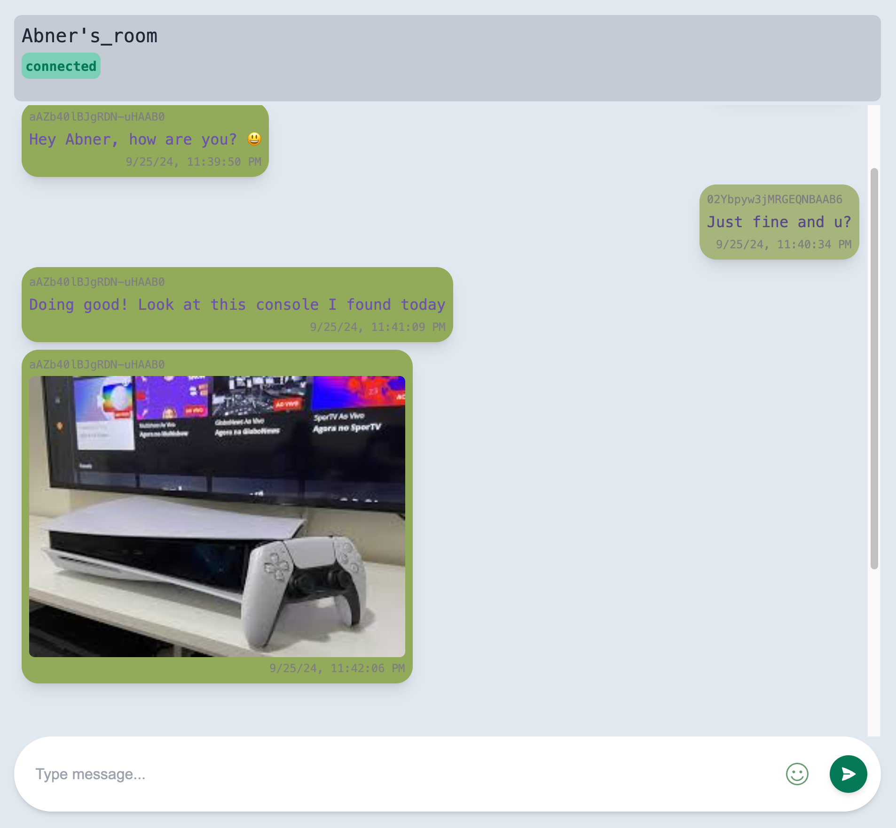

# Anonymous Chat App

An **anonymous chat application** built with **Next.js** and containerized using **Docker**. This app allows users to join chat rooms and communicate without revealing their identity, providing a secure and anonymous chatting experience.

Want to try out? Join a chat room [here](https://lionfish-app-jl362.ondigitalocean.app/room/my-room-name).



## Features

- **Real-time messaging**: Instant communication between users using WebSockets.
- **Anonymous login**: No registration required – users join chat rooms anonymously.
- **Multiple chat rooms**: Users can create or join different chat rooms for diverse discussions.
- **Responsive UI**: A modern, mobile-friendly design built using Next.js and TailwindCSS.
- **Secure communication**: Messages are transmitted securely, with an emphasis on user privacy.
- **Dockerized environment**: Easily deployable through a Docker container for consistency across environments.

## Technologies

- **Next.js**: Front-end framework for building server-side rendered React applications.
- **WebSockets/Socket.io**: Enables real-time communication between the client and the server.
- **Docker**: Containerization platform used to package the application for smooth deployment across environments.
- **TailwindCSS**: For styling the application with reusable components or utility-first CSS.

## Getting Started

### Prerequisites

Ensure you have the following installed on your machine:

- [Docker](https://docs.docker.com/get-docker/)
- [Node.js](https://nodejs.org/) (for local development)

### Setup

1. Clone the repository:

   ```bash
   git clone https://github.com/AbnerLandim/chat-next-app.git
   cd chat-next-app
   ```

2. Build and run the Docker container:

   ```bash
   docker-compose up --build
   ```

3. Access the application:

   The app will be running on `http://localhost:3000` by default.

### Local Development

If you prefer to run the app locally without Docker:

1. Install dependencies:

   ```bash
   pnpm install
   ```

2. Run the development server:

   ```bash
   pnpm run dev
   ```

3. Open `http://localhost:3000` in your browser to view the app.

## Docker Deployment

To deploy the application using Docker, use the following commands:

1. Build the Docker image:

   ```bash
   docker build -t anonymous-chat-app .
   ```

2. Run the Docker container:

   ```bash
   docker run -p 3000:3000 anonymous-chat-app
   ```

## Contributing

Feel free to fork this repository and submit pull requests for any features or improvements!

## License

This project is licensed under the MIT License - see the [LICENSE](LICENSE) file for details.
